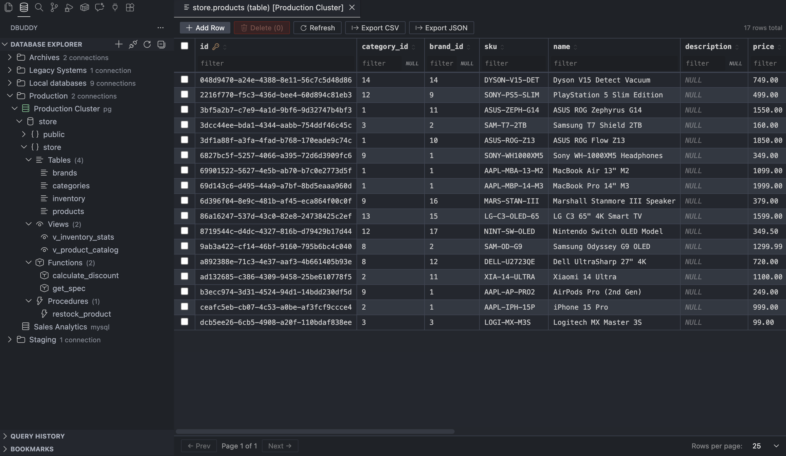
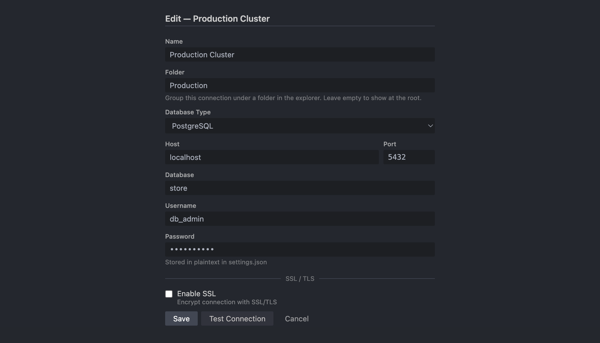
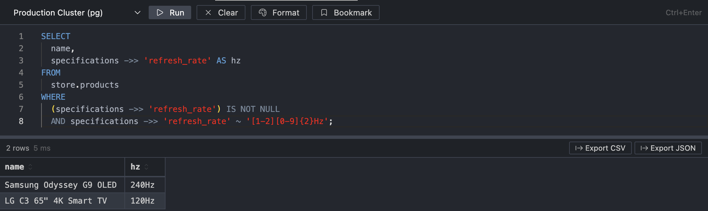
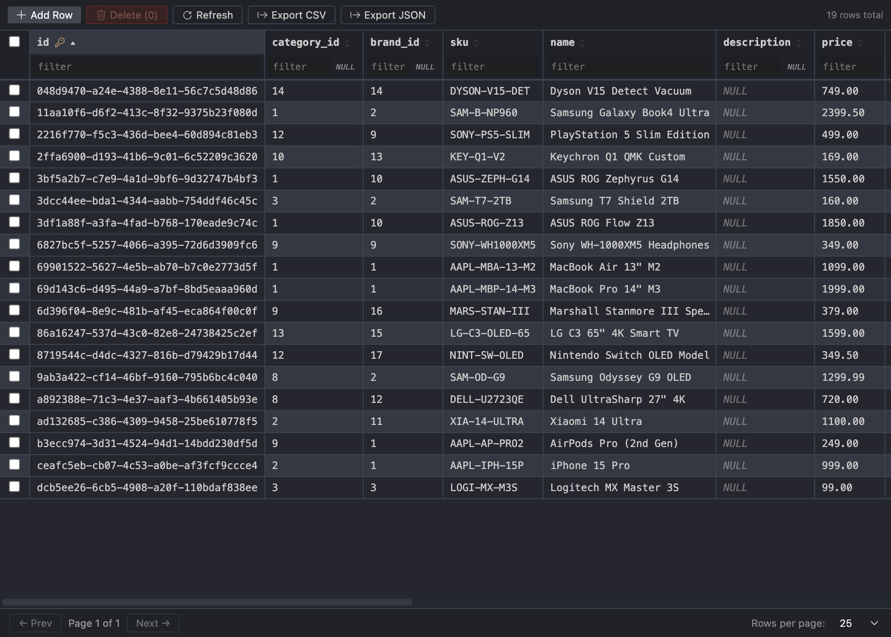
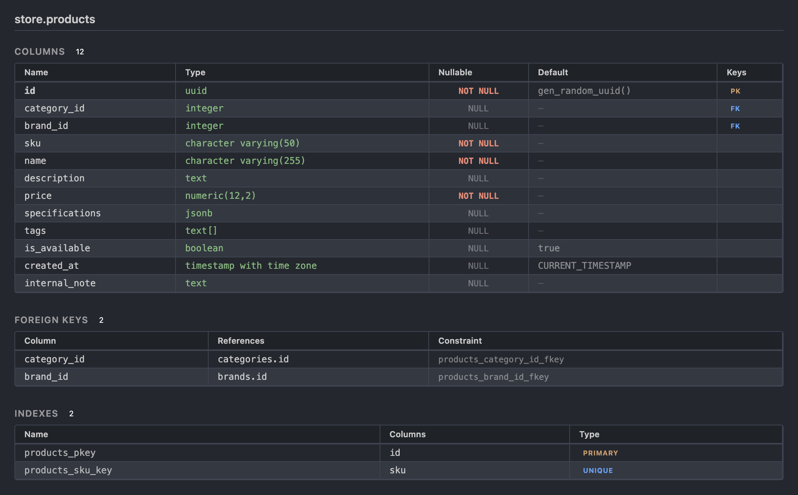

# RapiDB — Database Client for VS Code

PostgreSQL · MySQL · MSSQL · SQLite · MariaDB · Oracle — all in one place, never leaving your editor.

  
 

---

You know the drill: you're deep in the code, something's off in the data, and now you have to alt-tab to DBeaver, wait for it to wake up, click through five menus to find the table you need. RapiDB kills that context switch. Your database is right there in the sidebar, same window, same shortcuts, same theme.

---

## What it actually does

### Connect to anything

PostgreSQL, MySQL, MSSQL, SQL Server, SQLite, MariaDB, and Oracle — all supported out of the box. SSL, self-signed certs, Oracle service names, thick mode with Instant Client, connection folders to keep things organized. One sidebar, all your databases.

### Browse your schema without a single query

The **Database Explorer** tree expands into databases → schemas → tables, views, functions, and stored procedures. Right-click any table and grab its name, open the data viewer, inspect the schema, or pull the DDL — no typing required.

### A real SQL editor, not a textarea

The query editor is Monaco — same engine as VS Code itself. You get syntax highlighting, auto-formatting, and schema-aware autocompletion that knows your actual table and column names. Hit **Ctrl+Enter** (or **F5**) to run. Select a fragment to run just that part. Drag the divider to resize editor vs results however you like.

### Results that don't freeze at 10k rows

Results come back in a virtualized table — sortable by any column, with resizable columns and alternating row stripes so your eyes don't go blurry. NULL values are styled differently. Booleans are colored. Execution time is shown right in the toolbar. Hit **Export CSV** or **Export JSON** when you need the data out.

If the result is truncated, a warning tells you exactly how many rows were cut and how to lift the limit.

### Browse and edit table data

Double-click any table → the **Table Data Viewer** opens with full pagination (25 / 100 / 500 / 1000 rows per page), per-column filters, and column sorting. Need to fix a value? Click the cell, type, hit Enter. Need a new row? The insert bar appears at the bottom. Selecting rows lets you delete them. Every write goes through a transaction — nothing half-applied.

### Schema inspector

Right-click → **Open Schema** to see every column with its type, nullability, default value, and PK / FK badges. Indexes and foreign keys get their own sections. Everything you'd normally Google `information_schema` for is one click away.

### Query History & Bookmarks

Every query you run lands in **Query History** — click any entry to reopen it in the editor. Queries you want to keep forever go into **Bookmarks** with a single button press. History and bookmark limits are configurable in settings.

---

## Settings worth knowing

| Setting | Default | What it does |
|---|---|---|
| `rapidb.queryRowLimit` | 10 000 | Cap on rows returned per query (100–100 000) |
| `rapidb.queryHistoryLimit` | 100 | How many past queries to remember |
| `rapidb.defaultPageSize` | 25 | Default rows per page in the Table Data Viewer |

---

## Getting started

1. Install the extension.
2. Click the **RapiDB icon** in the Activity Bar.
3. Hit **Add Connection** (the `+` button) and fill in your credentials.
4. Done. Explore, query, edit.

---

## Found a bug? Have an idea?

**Please [leave a review in the Marketplace](https://marketplace.visualstudio.com/items?itemName=DmitriiKholkin.rapidb&ssr=false#review-details)** — even a short one helps others decide whether RapiDB fits their workflow, and tells me what's working.

For bugs and feature requests, **[open an issue on GitHub](https://github.com/DmitriiKholkin/RapiDB/issues)**. I'm genuinely tracking everything there and fixing issues fast. If something is broken for you, drop an issue with the steps to reproduce and the DB type — I'll get back to you quickly.

---

For developers

**Stack:**
- Extension host: TypeScript, VS Code Extension API
- Webview UI: React 19, Monaco Editor, TanStack Table, TanStack Virtual, Zustand
- SQL formatting: sql-formatter
- DB drivers: `pg`, `mysql2`, `mssql`, `oracledb`, `node-sqlite3-wasm`
- Bundler: esbuild

PRs and contributions are welcome at [github.com/DmitriiKholkin/RapiDB](https://github.com/DmitriiKholkin/RapiDB).

---

**License:** **[MIT License](LICENSE.md)**
