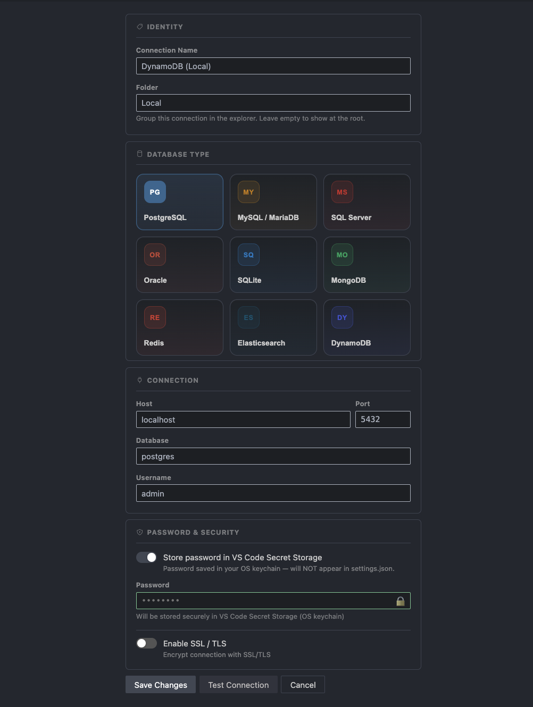
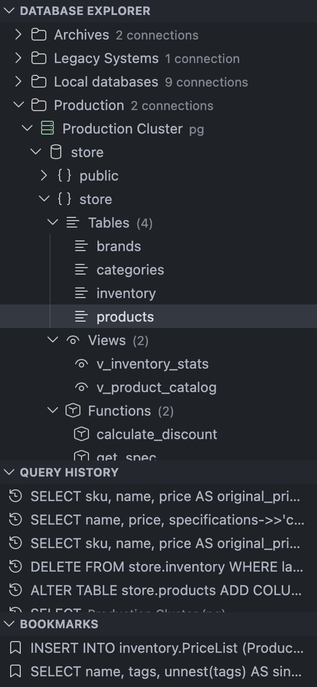
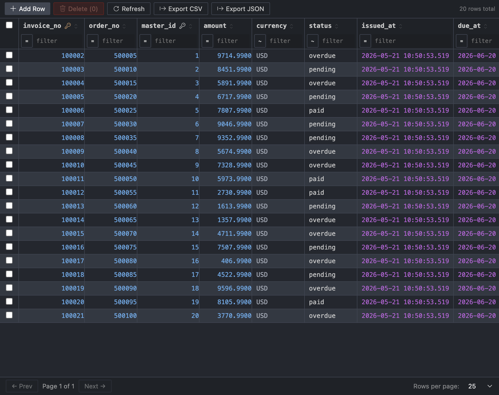

<div align="center">

<br/>


<br/>
<br/>

# RapiDB — Database Client for VS Code

### PostgreSQL · MSSQL · MySQL · MariaDB · SQLite · Oracle
### Redis · MongoDB · Elasticsearch · DynamoDB
#### All in one place. Never leaving your editor.

<br/>

[](https://open-vsx.org/extension/DmitriiKholkin/rapidb)
[](https://github.com/DmitriiKholkin/RapiDB)
[](https://opensource.org/licenses/MIT)

<br/>

<a href="https://marketplace.visualstudio.com/items?itemName=DmitriiKholkin.rapidb">
  
</a>

<br/>

---

*You're deep in the code. Something's off in the data.*
*Now you have to alt-tab to DBeaver, wait for it to wake up,*
*click through five menus...*

**RapiDB kills that context switch.**
Your database lives in the sidebar — same window, same shortcuts, same theme.

---


<br/>

# ⚡ What it actually does

</div>

<br/>

### 🔌 Connect to anything

PostgreSQL, MS SQL Server, MySQL, MariaDB, SQLite, Oracle, Redis, MongoDB, Elasticsearch, DynamoDB  — all supported out of the box. SSL, self-signed certs, connection folders to keep things organized.



<br/>

### 🌲 Browse your schema without a single query

Saved connections can be grouped into folders, and each connection expands into databases → schemas → tables, views, materialized views, functions, procedures, sequences, and types. Right-click any object to copy its name, inspect columns with PK/FK badges, constraints, indexes, and triggers, open the data viewer where it applies, or pull the DDL / definition — no typing required.



<br/>

### 🗂️ Query History & Bookmarks

Every query you run lands in **Query History** — click any entry to reopen it in the editor. Queries you want to keep forever go into **Bookmarks** with a single press. Query History limit is configurable.

<br/>

### 🧩 ERD with foreign key links

Open ERD from a database or schema node to visualize tables and the foreign key relationships between them. The diagram is built from live schema metadata, so it stays aligned with the current database snapshot.


<br/>

### ✏️ A real SQL editor, not a textarea

The query editor runs on **Monaco** — the same engine as VS Code itself. You get:

- 🎨 Syntax highlighting & SQL formatting (button / `Shift+Alt+F`)
- 🧠 Schema-aware autocompletion — knows your actual tables and columns
- ⌨️ `Ctrl+Enter` / `F5` to run · Select a fragment to run just that part
- ↕️ Drag the divider to resize editor vs results


<br/>

### 📊 Results that don't freeze at 10k rows

Results land in a **virtualized table** — no jank, no browser tab hanging:

- Sort by any column · Resize columns · Alternating row stripes
- NULL values are styled differently · Values are colored by types
- Execution time shown right in the toolbar
- **Export to CSV or JSON** in one click

> If results are truncated, a warning tells you exactly how many rows were cut and how to lift the limit.

<br/>

### ✍️ Browse and edit table data

Click any table → the **Table Data Viewer** opens:

| Feature | Detail |
|---|---|
| Pagination | 25 / 100 / 500 / 1000 rows per page |
| Filtering | Draft-aware per-column filters |
| Inline editing | Click a cell → type → Enter |
| New rows | Insert bar at the top |
| Deletion | Select rows and delete |
| Safety | Preview-first apply flow with verification; transactional where applicable |

<br/>



<br/>

---

## ⚙️ Settings worth knowing

| Setting | Default | What it does |
|---|---|---|
| `rapidb.connections` | `[]` | Saved connections, including folders and other data |
| `rapidb.connectionTimeoutSeconds` | `15` | Timeout for establishing a database connection |
| `rapidb.dbOperationTimeoutSeconds` | `180` | Timeout for queries, metadata, DDL, and routine loading |
| `rapidb.queryRowLimit` | `10000` | Cap on rows returned per query (100–100000) |
| `rapidb.queryHistoryLimit` | `100` | How many past queries to remember |
| `rapidb.defaultPageSize` | `25` | Default rows per page in the Table Data Viewer |

---

## 🚀 Get started in 4 steps

```
1. Install the extension
2. Click the RapiDB icon in the Activity Bar
3. Hit Add Connection (+) and fill in your credentials
4. Done — explore, query, edit
```

---

## 💬 Found a bug? Have an idea?

**[⭐ Leave a review in the Marketplace](https://marketplace.visualstudio.com/items?itemName=DmitriiKholkin.rapidb&ssr=false#review-details)** — even a short one helps others decide whether RapiDB fits their workflow, and tells me what's working.

**[🐛 Open an issue on GitHub](https://github.com/DmitriiKholkin/RapiDB/issues)** — I'm tracking everything there and fixing issues fast. Drop an issue with steps to reproduce and the DB type, and I'll get back to you quickly.

---

<details>

<summary>🛠️ For developers</summary>

<br/>

**Stack:**

| Layer | Technology |
|---|---|
| Extension host | TypeScript, VS Code Extension API |
| Webview UI | React 19, Monaco Editor, TanStack Table, TanStack Virtual, Zustand |
| ERD | `@xyflow/react`, `@dagrejs/dagre` |
| SQL formatting | `sql-formatter` |
| DB drivers | `pg`, `mysql2`, `mssql`, `oracledb`, `node-sqlite3-wasm`, `redis`, `mongodb`, `@elastic/elasticsearch`, `@aws-sdk/client-dynamodb` |
| VS Code icons | `@vscode/codicons` |
| Bundler | esbuild |

PRs and contributions are welcome at [github.com/DmitriiKholkin/RapiDB](https://github.com/DmitriiKholkin/RapiDB).

</details>


---

<div align="center">

**MIT License** · Made with love and the desire to never alt-tab again

</div>