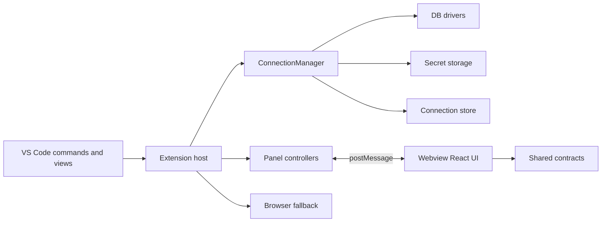

# Architecture Overview

RapiDB is built as a split-runtime VS Code extension:

- the extension host owns state, data access, and commands,
- the webview owns rendering and user interaction,
- shared modules define the message and state contracts,
- the browser build provides a limited fallback.

## System Boundary Map

## Command And View Surface

| Surface | What it exposes | Main implementation anchor |
|---|---|---|
| Activity Bar container | RapiDB explorer entry point | [package.json](../../package.json) |
| Tree views | Database Explorer, Query History, Bookmarks | [package.json](../../package.json) and [src/extension/providers](../../src/extension/providers) |
| Commands | Add connection, connect, disconnect, new query, open data, show DDL, open ERD, open history/bookmark entries, clear history/bookmarks | [package.json](../../package.json) and [src/extension/extension.ts](../../src/extension/extension.ts) |
| Panels | Connection form, query editor, table data view, ERD | [src/extension/panels](../../src/extension/panels) |

## Runtime Responsibilities

| Subsystem | Responsibility | Notes |
|---|---|---|
| Activation | Registers commands, providers, and tree data sources | It is the first place to inspect when a command or tree node disappears. |
| Connection management | Stores connection definitions, folders, and secret metadata | See [security/secrets.md](../security/secrets.md) for storage rules. |
| DB drivers | Abstracts engine-specific quirks, timeouts, metadata, and query behavior | See [reference/driver-matrix.md](../reference/driver-matrix.md). |
| Table mutation service | Generates preview SQL, applies changes, and verifies mutation results | Critical for bug fixes around inline editing. |
| ERD service | Builds graph nodes and relationships from live metadata | Connects host metadata to webview layout. |
| Webview UI | Renders the product UI and sends user actions back | The UI should not own the source of truth for DB state. |

## Why The Split Matters

The split keeps the host authoritative and the UI disposable. That makes the system easier to test, but it also means most bugs are boundary bugs: message shape mismatches, stale initial state, driver-specific assumptions, or incorrect secret masking.

## Architecture Rules Of Thumb

| Rule | Practical meaning |
|---|---|
| Shared types are the contract | If a message or initial state shape changes, update [reference/contracts.md](../reference/contracts.md) and the matching tests. |
| Drivers own engine quirks | Do not push engine-specific SQL or formatting behavior into the webview. |
| The host enforces safety | Hard caps, read-only guards, and mutation preview logic live on the extension side. |
| Browser mode is limited | Document it as a fallback, not a feature-parity target. |
