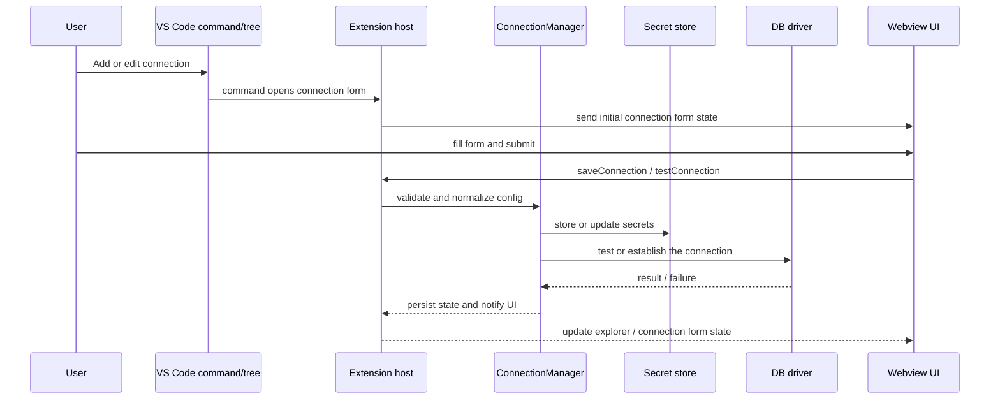
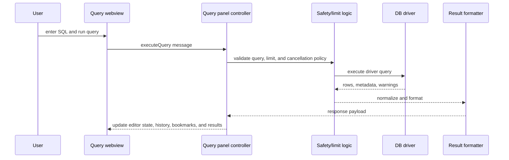
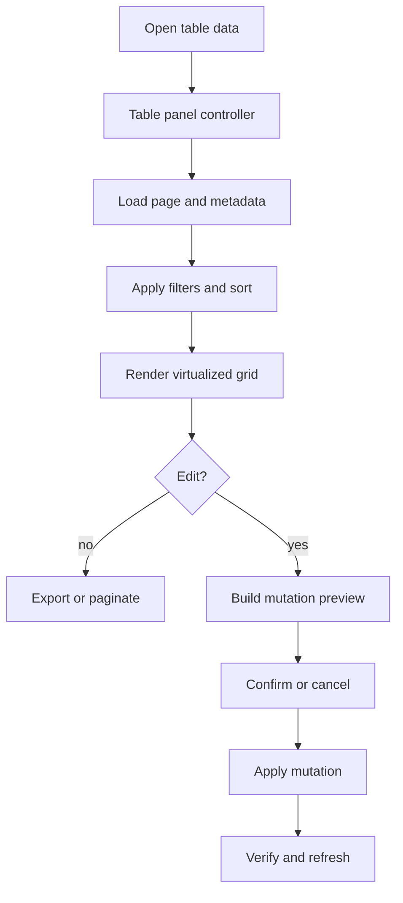
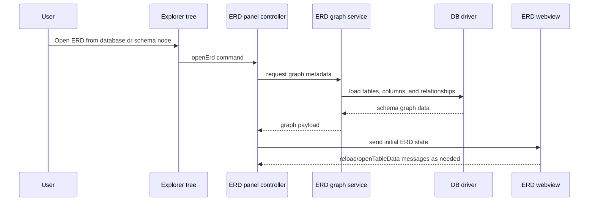

# Runtime Flows

This page traces the main end-to-end flows through the application. Use it when a bug spans more than one subsystem.

## 1. Connection Flow

### Key checkpoints

| Step | What can fail | Where to inspect |
|---|---|---|
| Form opens | Wrong initial state or retention mode | [src/shared/webviewContracts.ts](../../src/shared/webviewContracts.ts) and panel controller code |
| Save/test submits | Payload mismatch or missing secret fields | [src/webview/components/ConnectionFormView.tsx](../../src/webview/components/ConnectionFormView.tsx) and [src/shared/webviewContracts.ts](../../src/shared/webviewContracts.ts) |
| Driver connection | Timeout, auth, native addon, or SSH issue | [src/extension/services/connectionValidationService.ts](../../src/extension/services/connectionValidationService.ts), [src/extension/services/sshRuntime.ts](../../src/extension/services/sshRuntime.ts), and the driver file |

## 2. Query Execution Flow

### Query concerns

| Concern | Why it exists | Relevant files |
|---|---|---|
| Hard row cap | Prevents runaway result sets | [src/shared/safetyContracts.ts](../../src/shared/safetyContracts.ts), [src/extension/utils/queryResultFormatting.ts](../../src/extension/utils/queryResultFormatting.ts) |
| Cancel/timeout handling | Avoids late or duplicate settlements | [src/shared/safetyContracts.ts](../../src/shared/safetyContracts.ts), [src/extension/dbDrivers/timeout.ts](../../src/extension/dbDrivers/timeout.ts) |
| Driver-specific SQL | Different engines need different rewrites | [src/extension/dbDrivers](../../src/extension/dbDrivers) |

## 3. Table Browse And Edit Flow

### Mutation behavior

| Stage | Purpose | Notes |
|---|---|---|
| Preview | Show the SQL or equivalent mutation before changes are applied | Implemented on the host side, not in the webview. |
| Confirm | Let the user accept or cancel the proposed change set | Useful when multiple rows are edited or deleted. |
| Apply | Execute inserts, updates, or deletes | Must respect driver capabilities and read-only guards. |
| Verify | Confirm the final state matches the intended mutation | If verification fails, the panel should surface the failure clearly. |

## 4. ERD Flow

