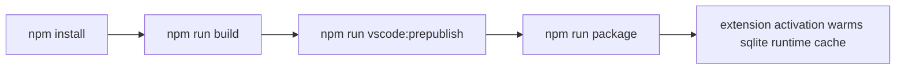

# Packaging Handbook

RapiDB packaging is intentionally lean: the VSIX ships the `better-sqlite3` JavaScript scaffold, while the host-specific native SQLite binary is downloaded into the extension cache on startup and on first SQLite use.

## Build And Package Pipeline

## Primary Commands

| Command | Meaning |
|---|---|
| `npm run build` | Build the desktop, browser, and webview bundles. |
| `npm run watch` | Watch mode for local development. |
| `npm run package:prepare` | Prepare package metadata and packaging inputs. |
| `npm run vscode:prepublish` | Full publish preflight: prepare packaging inputs and produce production bundles. |
| `npm run package` | Create the VSIX package. |

## Packaging Checklist

| Step | Why it exists |
|---|---|
| Confirm Node and VS Code engine compatibility | The extension targets a specific minimum runtime. |
| Run the build | Ensures the generated bundles are current before packaging. |
| Keep the bundled SQLite scaffold lean | Prevents host-specific `.node` binaries from being baked into the VSIX. |
| Run tests that touch packaging or sqlite | Prevents shipping a broken startup or first-connect install path. |
| Create the VSIX | Produces the distributable artifact. |

## Related Files

| File | Purpose |
|---|---|
| [scripts/prepare-vscode-package.mjs](../../scripts/prepare-vscode-package.mjs) | Packaging input preparation. |
| [src/extension/utils/sqliteInstaller.ts](../../src/extension/utils/sqliteInstaller.ts) | On-demand SQLite runtime installation into the extension cache. |
| [esbuild.config.mjs](../../esbuild.config.mjs) | Bundle generation. |
| [compose.yaml](../../compose.yaml) | Live DB services used by tests that should pass before release. |
